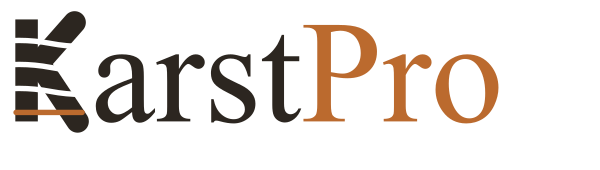

<p align="center">
  
</p>

<p align="center">
  <strong>Prospection karstique assistée par QGIS &amp; QField</strong><br>
  Analyse LiDAR HD IGN → détection de dolines → scoring morphométrique → terrain
</p>

<p align="center">
  
  
  
  
</p>

---

**KarstPro** est un plugin QGIS qui automatise la prospection spéléologique à
partir du **LiDAR HD de l'IGN**. Là où transformer un nuage de points en cibles
terrain demandait plusieurs jours de travail SIG manuel, KarstPro le fait en
**quelques heures, de manière reproductible**, et vous ressortez avec un projet
QField prêt pour le terrain et un rapport structuré.

> 📖 **[Documentation complète illustrée (PDF) →](KarstPro_Documentation.pdf)**
> Guide pas à pas du bureau au terrain, référence des paramètres, scoring, export.
> Pour la rigueur scientifique complète du scoring (validation, AUC, seuils) :
> voir `DOC_TECHNIQUE_DETECTION.md`, fourni dans cette même archive.

---

## ✨ Ce que fait KarstPro

- 🛰️ **Télécharge le LiDAR HD IGN** automatiquement sur la zone dessinée
  (COPC LAZ, lecture partielle par bbox — pas de téléchargement inutile).
- ⛰️ **Génère un MNT 1 m** et **détecte les dolines** par remplissage des
  dépressions (Fill sinks) + vectorisation, **et les gouffres / puits
  verticaux** par leur signature de vide LiDAR (couche `gouffres`). Localise
  aussi les **points d'eau karstiques référencés** (sources, pertes, inversacs,
  résurgences — BD Topo, couche `bdtopo_eau`) pour les entrées noyées,
  invisibles au MNT (le LiDAR réfléchit sur l'eau).
- 🔻 **Détecte un signal ponctuel de puits invisible au MNT lissé** : sous
  un seuil de surface configurable, compare l'altitude minimale des
  derniers retours LiDAR bruts à une référence de voisinage — révèle
  parfois une profondeur qu'un puits étroit ne laisse pas voir une fois le
  MNT lissé. Purement informatif (n'affecte jamais le score ni la
  priorité), signalé par un anneau sur la doline concernée et une section
  dédiée du rapport MLL.
- 🎯 **Priorise chaque doline en P1 / P2 / P3** : modèle appris appliqué
  automatiquement quand la zone est dans le domaine géologique validé
  (Barrois), sinon score morphométrique exploratoire sur 8 composantes
  (profondeur, contact géologique, pente, absorption, TPI…). Quatre autres
  modèles régionaux **opt-in** (Jura plateau, Lot, Dordogne, Ardèche) sont
  activables manuellement via **« Forcer un modèle différent »**.
- 🔍 **Diagnostique un modèle sur une commune** : applique chaque modèle
  appris disponible aux dolines déjà détectées et mesure son AUC réel
  contre un inventaire de cavités connues (même partiel, ou la seule
  couche Géorisques publique) — vérifie empiriquement si un modèle
  s'applique avant de l'activer, sans jamais le faire automatiquement.
- 📱 **Prépare un projet QField** clé en main : symbologie par priorité,
  saisie GPS des nouvelles cavités, **photo** sur les cavités/cibles/gouffres,
  couches de référence en lecture seule, et en option un fond **SCAN25 IGN**
  (1/25 000, décoché par défaut, clé API personnelle à fournir — aucune clé
  livrée avec le plugin).
- 🔄 **Synchronise le retour terrain** : exporte un **CSV importable dans Karst
  Entry** (cavités, cibles et gouffres à intérêt — référence + commune géocodée +
  altitude + photos) et un **rapport PDF**. KarstPro détecte et va sur le
  terrain ; Karst Entry gère l'inventaire et dédoublonne à l'import.
- 📝 **Exporte pour analyse MLL** : prompt narratif structuré + données brutes
  en CSV/JSON séparés (à joindre au même message), une **carte de contexte**
  (relief exagéré, dolines P1/P2, signal ponctuel LiDAR, réseau karstique
  connu, géologie BRGM, échelle et flèche du nord) pour un LLM multimodal,
  et un GPX prêt pour le terrain (Garmin/OruxMaps/QGIS).
- ♻️ **Refait une étude** avec les mêmes paramètres (utile après un changement
  de traitement MNT/détection/scoring) — sans re-saisie, verdicts terrain
  préservés, garde-fous anti-perte de données.

---

## ⚙️ Installation

> **Prérequis** — [QGIS](https://qgis.org) ≥ 3.34 LTR (testé sur 3.40, 4.0.2 et
> 4.2.0). Une connexion internet est requise au premier lancement.

### Windows (recommandée)

Télécharger `KarstPro_Setup_v<version>.exe` depuis la
**[page des Releases](https://github.com/julientournois/KarstPro-qgis/releases)**
et double-cliquer dessus. Un seul assistant détecte les profils QGIS,
installe le plugin et ses dépendances Python, et propose d'enregistrer le
dépôt de mises à jour automatiques — sans dépendre d'aucun fichier externe.
Windows peut afficher un avertissement SmartScreen (éditeur non reconnu,
l'installeur n'est pas signé) : cliquer sur *Informations complémentaires →
Exécuter quand même*.

### Linux, ou méthode alternative (archive ZIP)

1. **Télécharger** ce dépôt (bouton **Code → Download ZIP**) et le décompresser.
2. Lancer le script d'installation :
   - **Windows** — double-cliquer sur **`install_windows.bat`**
   - **Linux** — `chmod +x install_linux.sh && ./install_linux.sh`

   Le script installe le plugin **et** ses dépendances Python en une fois.
3. **Redémarrer QGIS**, puis **Extensions → Gérer et installer des extensions →
   Installées** et cocher **KarstPro**.

### Méthode manuelle (optionnel)

1. **Plugin** — QGIS → **Extensions → Installer depuis un ZIP** → choisir
   `karstpro.zip`.
2. **Dépendances** — QGIS → **Extensions → Console Python**, puis exécuter :
   `import karstpro.install_dependencies`
   (vise toujours le bon Python, celui de QGIS).

Les outils apparaissent ensuite dans **Traitement → Boîte à outils → KarstPro**.

---

## 🧭 Le workflow en bref

```
①  Préparer       ②  Envoyer        ③  Saisir         ④  Synchroniser
   (bureau)          (QFieldCloud)     (QField)          (retour terrain)
   LiDAR → dolines   projet sur le     cavités GPS +     CSV Karst Entry
   scorées → QGIS    téléphone         photos terrain    + rapport PDF
```

1. **Préparer une sortie** — dessiner la zone, KarstPro télécharge le LiDAR,
   détecte et score les dolines, et construit le projet QGIS/QField.
2. **Envoyer sur le téléphone** via QFieldCloud.
3. **Saisir** les cavités découvertes sur le terrain (position GPS).
4. **Rapatrier et synchroniser** : un **CSV pour Karst Entry** + un **rapport
   PDF** sont générés (à importer dans Karst Entry) ; l'export MLL prépare
   l'analyse.

*(Procédure illustrée complète dans la [documentation PDF](KarstPro_Documentation.pdf).)*

---

## 🗂️ Données utilisées (libres, gratuites, automatiques)

| Source | Données |
|--------|---------|
| **IGN LiDAR HD** | Nuage de points COPC LAZ, résolution ≥ 1 pt/m² |
| **BRGM** | Géologie (BD Charm-50 / LITHO_1M) pour le contact karstifiable |
| **Géorisques** | Cavités souterraines référencées (contexte) |

---

## ⚠️ Portée de l'outil

KarstPro **priorise** la prospection — il ne la remplace pas. Sur un domaine
géologique validé, un **modèle appris** pilote la priorisation (AUC 0,60–0,72
hors-échantillon, contre ~0,57 pour les poids manuels). Cinq domaines sont
livrés : **Barrois** (Meuse/Haute-Marne, appliqué automatiquement) et, en
**opt-in** (à activer via « Forcer un modèle différent » si l'on connaît le
contexte géologique local), **Jura plateau** (AUC 0,633), **Ardèche** (0,638),
**Dordogne** (0,629) et **Lot** (0,602). Hors domaine, la priorisation
P1/P2/P3 retombe sur un **indice morphologique exploratoire**. L'AUC plafonne
à ~0,60-0,72 selon le domaine — une limite *physique* de la morphologie de
surface : ce n'est jamais une prédiction de spéléogenèse, la validation terrain
reste indispensable. L'inventaire LiDAR et le workflow bureau ↔ terrain, eux,
sont pleinement opérationnels.

---

## ⚖️ Licence

Distribué sous **[PolyForm Noncommercial 1.0](https://polyformproject.org/licenses/noncommercial/1.0.0/)**.
Usage non commercial libre ; usage commercial sur autorisation écrite.

## ✉️ Contact

**Julien Tournois** — [julien.tournois@gmail.com](mailto:julien.tournois@gmail.com)
